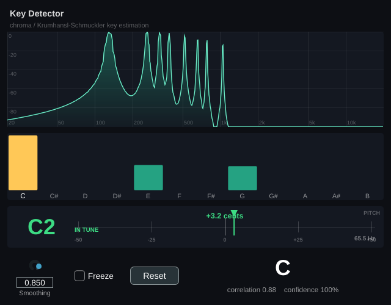
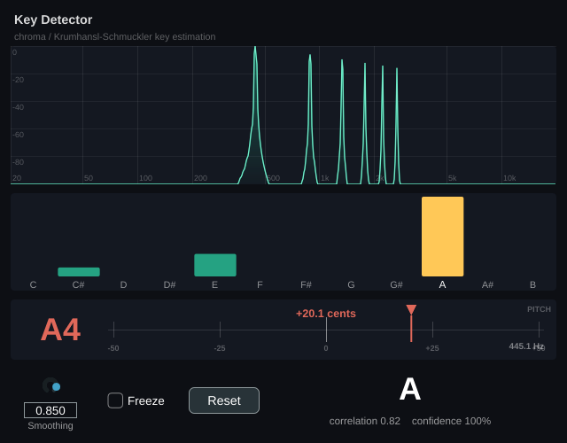

# Key Detector — JUCE VST3 chroma key-estimation plugin

A JUCE / C++ audio plugin that listens to incoming audio, computes its short-time
FFT spectrum, folds it into a 12-bin **chroma** vector (pitch-class energy) and
estimates the musical **key** by correlating the chroma against the
Krumhansl–Schmuckler key profiles. It also includes a **monophonic tuner** (YIN
pitch detection) that shows the nearest note and cents deviation when a single note
is played. The UI shows a live spectrum analyser, the chroma bars, the tuner, and
the detected key with a confidence read-out.

Builds as **VST3**, **AU** (macOS) and **Standalone** (Windows / macOS / Linux).



The tuner lights up when a single note is played (it stays idle on full mixes):




```
audio in ─► mono sum ─► FIFO(8192, 75% overlap) ─► Hann ─► FFT ─► |X[k]|
        ─► peak-picking + parabolic interp ─► 12-bin chroma ─► EMA
        ─► Krumhansl–Schmuckler correlation (24 keys) + hysteresis ─► key
        └► YIN autocorrelation on the same buffer ─► note + cents (tuner)
```

## Instrument vs. effect (design note)

The task asked for an "instrument" plugin, but a key detector must **receive**
audio to analyse it, whereas a sound-generating instrument (VSTi) has no audio
input. So this is built as an **analyser/effect** (`IS_SYNTH FALSE`,
`VST3_CATEGORIES "Analyzer" "Fx"`): drop it on an audio track's insert chain; it
passes the audio through untouched and displays the key. To force host
registration as a synth, flip `IS_SYNTH`/`NEEDS_MIDI_INPUT` in `CMakeLists.txt`.

## Project layout

```
KeyDetector/
├── CMakeLists.txt              # JUCE plugin target + standalone DSP test
├── Source/
│   ├── ChromaKeyDetector.h/.cpp  # DSP core (NO JUCE dependency, unit-testable)
│   ├── PitchDetector.h/.cpp      # YIN monophonic pitch detector (tuner, no JUCE)
│   ├── PluginProcessor.h/.cpp    # audio thread: FIFO → FFT → chroma → publish
│   ├── PluginEditor.h/.cpp       # GUI + 30 Hz timer polling the processor
│   └── SpectrumAnalyzer.h/.cpp   # spectrum + chroma + tuner display components
└── tests/
    ├── ChromaKeyDetectorTest.cpp # pure-C++17 sanity tests (ctest)
    └── PitchDetectorTest.cpp     # YIN accuracy tests (ctest)
```

## Algorithmic choices (and why)

- **FFT size = 8192 (order 13), Hann window, 75% overlap.** ~5.9 Hz/bin @ 48 kHz
  for sharp low-end resolution, with a new frame every ~43 ms (hop = 2048) so the
  display stays responsive and the key detector gets 4x more frames to average.
  The Hann window suppresses spectral leakage so pitch energy stays in the right
  bins. Low notes are reinforced by their **harmonics** in well-resolved higher
  bins, which keeps octave-collapsed chroma robust.
- **Spectrum display** resamples the magnitude spectrum into one column per pixel
  on a log-frequency axis (interpolating at the low end, peak-aggregating at the
  high end) with fast-attack / slow-release smoothing and a peak-hold trace, so
  there is uniform detail across 20 Hz – 20 kHz.
- **Peak-based chroma (Harmonic Pitch-Class Profile).** Instead of dumping every
  FFT bin into a pitch class (which lets the broadband noise floor between partials
  dilute the result), only **spectral peaks** (local maxima above a relative
  threshold) are used. Each peak's frequency is refined with **parabolic
  interpolation** (sub-bin accuracy), snapped to the nearest note on the supplied
  A440 table, and rejected if it's more than a quarter-tone from any note. This is
  what makes the key read cleanly on real material. Each frame is L1-normalised
  (so loudness doesn't bias it) and folded into a running EMA for stability.
- **Key selection.** Two methods are available:
  * **Krumhansl–Schmuckler correlation (default)** — the chroma is correlated
    (Pearson) with all 12 major (and 12 minor) key-profile rotations and the best
    match wins; confidence is the margin over the runner-up. This correctly
    identifies the tonic even when the loudest pitch class is the fifth (on a chord
    the root is usually *not* the loudest note, because the root's 3rd harmonic
    reinforces the fifth's pitch class).
  * **Dominant pitch** — simply the loudest pitch class (its major). Direct, but on
    chords it tends to report the fifth rather than the root; select it via
    `ChromaKeyDetector::setKeyMethod` if you want raw prominence.
- **Stability.** The chroma smoothing is defined by a **time constant** (the
  Smoothing knob maps to ~0.1–4 s), so the amount of averaging is independent of
  the FFT overlap/frame rate. On top of that, the reported key uses **hysteresis**:
  a new key only replaces the current one after it has been the instantaneous
  winner for ~0.7 s of continuous frames, so momentary frames can't make the
  readout flicker while genuine key changes still register within about a second.
- **Tuner (YIN + peak fallback).** A time-domain **YIN** detector estimates the
  monophonic fundamental to within a few cents for harmonic notes. When there is no
  clear harmonic pitch (e.g. **percussion / inharmonic / drums**), the tuner falls
  back to the **loudest spectral peak** (parabolic-interpolated) so it still reports
  the dominant frequency, labelled `PEAK` instead of `PITCH`. The reading maps to
  the nearest note (A440) with a cents needle.
- **Atonal gating.** The key read-out only appears when the chroma correlates well
  enough with a key profile. Percussion / atonal input gives a flat chroma (low
  correlation), so it shows **"no clear key"** rather than a spurious key.

## Controls

- **Smoothing** – EMA coefficient (0 = instant, ~0.85 = steady). Saved with state.
- **Freeze** – hold the current chroma/key (stop accumulating).
- **Reset** – clear the accumulated chroma and start estimating from scratch.

## Building

Requires CMake ≥ 3.22 and a C++17 compiler.

```bash
# From the KeyDetector/ directory. If a JUCE checkout sits at ../JUCE it is used
# automatically; otherwise pass -DKEYDETECTOR_FETCH_JUCE=ON to download JUCE 8.0.9.
cmake -B build -G Ninja -DCMAKE_BUILD_TYPE=Release
cmake --build build

# Run the DSP unit tests
ctest --test-dir build --output-on-failure
```

### Linux build dependencies

```bash
sudo apt-get install libasound2-dev libx11-dev libxext-dev libxrandr-dev \
    libxcursor-dev libxinerama-dev libfreetype-dev libfontconfig1-dev \
    libcurl4-openssl-dev libxrender-dev libxcomposite-dev
```

Build artefacts land in
`build/KeyDetector_artefacts/Release/VST3/Key Detector.vst3` and
`.../Standalone/Key Detector`.

## Windows build (for Ableton Live)

### About the file type — `.vst3`, not `.dll`

Modern plugins for Ableton on Windows are **VST3** (`Key Detector.vst3`), which is
a DLL-format binary in a small bundle folder. The old VST2 `.dll` format can't be
built anymore because Steinberg discontinued the VST2 SDK. Live 10.1+ loads VST3
natively.

> A Windows VST3 must be compiled with **MSVC** (Visual Studio) — that's the
> toolchain JUCE officially supports. JUCE 8's Windows renderer requires the
> Direct2D/DirectWrite SDK headers, so it cannot be cross-compiled from Linux with
> MinGW. Both options below build on Windows with MSVC.

### Option A — build on your Windows PC

1. Install **Visual Studio 2022** (Community is free) with the *Desktop
   development with C++* workload, plus **CMake** and **Git**.
2. Double-click **`build-windows.bat`** (or run it in a terminal). It downloads
   JUCE automatically and produces:
   `build\KeyDetector_artefacts\Release\VST3\Key Detector.vst3`

### Option B — let GitHub build it for you (no local compiler)

Push this project to a GitHub repo. The included workflow
`.github/workflows/windows-vst3.yml` builds the VST3 on a Windows runner; open the
**Actions** tab and download the **KeyDetector-VST3-Windows** artifact.

### Install & use in Ableton Live

1. Copy the `Key Detector.vst3` folder into `C:\Program Files\Common Files\VST3\`.
2. In Live: *Preferences → Plug-Ins →* enable **Use VST3 Plug-In System Folders**,
   then **Rescan**. "Key Detector" appears under *Plug-Ins*.
3. This is an **analyser** (it needs audio to analyse), so drop it on an **audio
   track** (or the Master) that is playing the material you want to key-detect. It
   passes the audio through and shows the detected key. It is *not* a
   sound-generating instrument — an instrument has no audio input and would have
   nothing to analyse.
